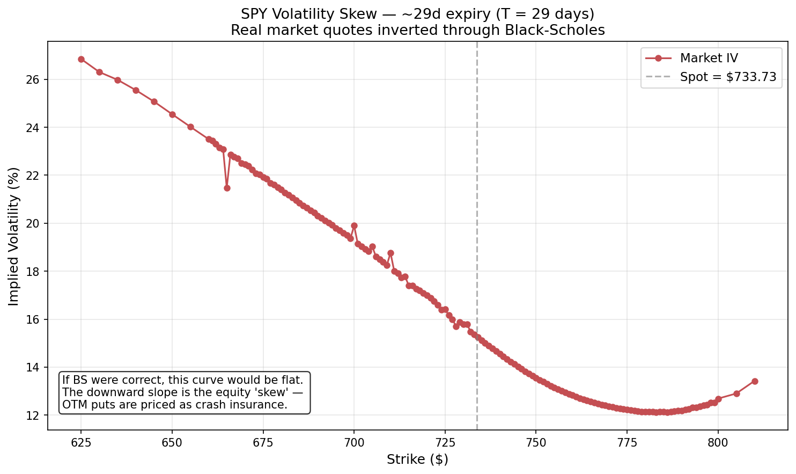
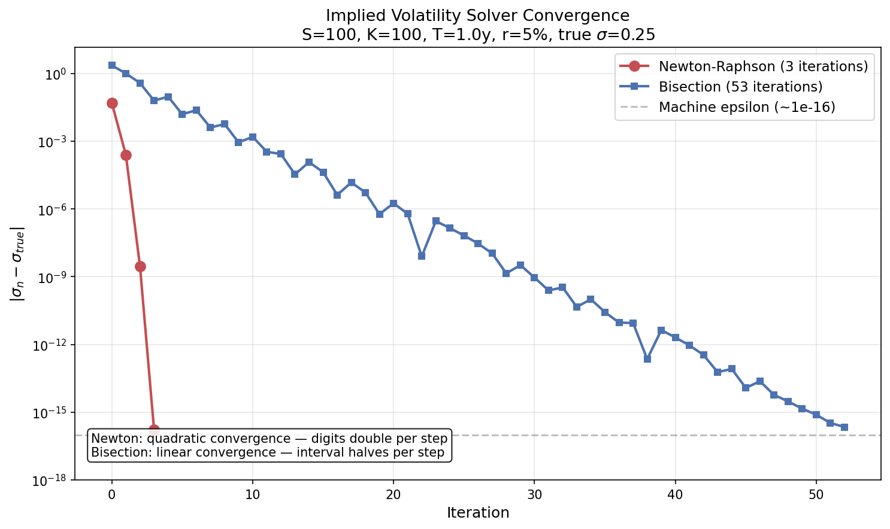

# Black-Scholes Options Pricer with Greeks, Implied Volatility, and Real-Market Smile

A clean, tested implementation of the Black-Scholes-Merton model for European options. Built from the ground up over four days as the foundation for a broader quantitative finance portfolio. Every component is verified with mathematical identity tests, numerical finite-difference tests, and round-trip consistency tests — 79 tests in total.

The capstone deliverable: pulling the SPY option chain from live market data, running the IV solver across strikes, and reproducing the equity volatility skew.

## Highlights

- **Closed-form Black-Scholes pricer** for European calls and puts, verified against Hull's textbook benchmarks to 4 decimal places
- **Five Greeks** (delta, gamma, vega, theta, rho) with analytical formulas verified against finite-difference approximations to 1e-5 precision
- **Two implied volatility solvers** — Newton-Raphson and bisection — with no-arbitrage validation and automatic fallback when Newton diverges
- **Real-market smile recovery**: pulled SPY option chain via Yahoo Finance, inverted through BS, reproduced the textbook equity skew
- **79 passing tests** across pricer, Greeks, and IV solvers (put-call parity, finite-difference verification, round-trip consistency, arbitrage bounds)

---

## Volatility Skew on Real Market Data



Implied volatility recovered from 200+ SPY call options on a single near-term expiry, plotted against strike. **The downward slope is the equity "skew"** — out-of-the-money puts (via put-call parity, equivalent to deep-ITM calls) priced as crash insurance, a permanent market feature since the 1987 crash.

If Black-Scholes were a complete model, this curve would be flat — because BS assumes a single constant σ, every option on the same underlying would round-trip to the same implied vol. The fact that it isn't flat is direct evidence that constant-volatility assumptions don't hold in real markets, and is the entire motivation for stochastic-volatility models like Heston, SABR, and local-vol frameworks like Dupire.

The notch in IV around $665 and the small kinks near $700-710 are real microstructure artifacts (round-number strike effects, hedging flow), not numerical noise. The slight upturn at the right tail near $800 is the right wing of a smile — pricing in some chance of upside melt-up moves.

Generated with `vol_smile.py` against live Yahoo Finance data; risk-free rate hardcoded at 4.5% (1-3M T-bill yield).

---

## Convergence — Newton vs. Bisection



Newton-Raphson converges to machine precision (~1e-16) in 3 iterations because each step roughly doubles the number of correct digits — quadratic convergence. Bisection takes 53 iterations to reach the same precision because it gains only one bit per step — linear convergence. Both methods are implemented; Newton is the default with bisection as a safety fallback when vega is too small for stable division (e.g., deep ITM or OTM options).

---

## The math

### Pricing formula

For a European call on a non-dividend-paying stock under Black-Scholes-Merton assumptions:

```
C = S * N(d1) - K * exp(-rT) * N(d2)
P = K * exp(-rT) * N(-d2) - S * N(-d1)

d1 = [ln(S/K) + (r + sigma^2 / 2) * T] / (sigma * sqrt(T))
d2 = d1 - sigma * sqrt(T)
```

Where `N(.)` is the standard normal CDF.

### Put-call parity

By a static no-arbitrage argument:

```
C - P = S - K * exp(-rT)
```

Enforced as a test across multiple parameter sets.

### Greeks

| Greek | Formula | Interpretation |
|-------|---------|----------------|
| Delta_call | `N(d1)` | dC/dS — sensitivity to underlying |
| Delta_put | `N(d1) - 1` | dP/dS |
| Gamma | `phi(d1) / (S * sigma * sqrt(T))` | d²V/dS² — same for call and put |
| Vega | `S * phi(d1) * sqrt(T)` | dV/dsigma — same for call and put |
| Theta_call | `-S*phi(d1)*sigma/(2*sqrt(T)) - r*K*exp(-rT)*N(d2)` | -dV/dt (time decay) |
| Theta_put | `-S*phi(d1)*sigma/(2*sqrt(T)) + r*K*exp(-rT)*N(-d2)` | |
| Rho_call | `K * T * exp(-rT) * N(d2)` | dV/dr |
| Rho_put | `-K * T * exp(-rT) * N(-d2)` | |

Where `phi(.)` is the standard normal PDF.

The fact that gamma and vega are the same for calls and puts at the same strike/expiry follows directly from put-call parity: since `C - P = S - K*exp(-rT)` is linear in S and independent of σ, its second derivative in S and its first derivative in σ are zero — so call and put gammas (and vegas) must be equal.

### Implied volatility

The Black-Scholes formula is monotonic in σ but transcendental, so there is no closed-form inversion. Given a market price, we solve `BS(σ) = C_market` numerically.

**Newton-Raphson iteration:**

```
σ_{n+1} = σ_n - (BS(σ_n) - C_market) / vega(σ_n)
```

The derivative `f'(σ) = vega(σ)` is reused directly from the Greeks module — yesterday's work becomes today's tool. Quadratic convergence in well-behaved regions; ~5-10 iterations to machine precision in practice. The IV solver falls back to bisection when vega becomes too small to divide by safely (deep ITM/OTM options).

**Bisection** is the bulletproof linear-convergence fallback: bracket the root in `[σ_low, σ_high]`, repeatedly halve the interval, gain one bit of precision per step. Slower but works whenever the root is bracketed.

### No-arbitrage bounds

Before solving for IV, we validate the quoted price against the static no-arbitrage range:

```
For a call: max(S - K*exp(-rT), 0) <= C <= S
For a put:  max(K*exp(-rT) - S, 0) <= P <= K*exp(-rT)
```

Prices outside this range have no valid implied volatility — the solver raises `ValueError`.

---

## What I learned about real data

The first run of `vol_smile.py` against the SPY chain returned IVs of 150%+ for deep ITM strikes — completely unrealistic. Investigating showed this wasn't a bug but a numerical artifact:

For deep ITM calls, the option is worth essentially intrinsic value `S - K*exp(-rT)`. The time-value component (the part that depends on volatility) is tiny, which means **vega is tiny**. In the Newton iteration `σ_new = σ - (BS - market) / vega`, when vega is microscopic, even a 1-cent error in the quoted mid-price gets amplified into a huge σ jump. The solver converges, but to a meaningless answer.

The theory predicted exactly where the code would fail. The fix is to filter strikes by moneyness (K/S between 0.85 and 1.15) — the liquid, informative region — which is what production vol-surface fitters all do. This is a small but real example of how numerical analysis intuition matters in quant work.

---

## Assumptions of the model

Standard BSM assumptions, each violated in real markets to some degree. Knowing where and how matters more than memorizing the list:

1. Underlying follows geometric Brownian motion (real markets exhibit jumps, vol clustering, fat tails)
2. Constant risk-free rate
3. Constant volatility (real implied vol shows the smile/skew above)
4. No dividends (this implementation; extendable via `S * exp(-qT)` for continuous dividend yield)
5. No transaction costs or taxes
6. European exercise only
7. Continuous trading
8. No arbitrage

The persistence of the volatility skew in real markets — clearly visible in the SPY plot above — is direct evidence that assumption #3 is violated, and is the entire motivation for stochastic-vol models like Heston.

---

## Project structure

```
bsm-pricer/
├── black_scholes.py       # Core pricer (Day 1)
├── greeks.py              # Five Greeks (Day 2)
├── implied_vol.py         # Newton-Raphson + Bisection solvers (Day 3)
├── vol_smile.py           # SPY smile from real data (Day 4)
├── plot_convergence.py    # Generates convergence_plot.png
├── test_pricer.py         # 12 tests
├── test_greeks.py         # 43 tests
├── test_implied_vol.py    # 24 tests
├── convergence_plot.png   # Newton vs bisection visualization
├── volatility_smile.png   # SPY skew from real market data
├── requirements.txt
└── README.md
```

## Running it

```bash
pip install -r requirements.txt

# Pricer + sanity check
python3 black_scholes.py

# Greeks + reference values
python3 greeks.py

# IV solver round-trip
python3 implied_vol.py

# Convergence plot
python3 plot_convergence.py

# SPY volatility smile from live data
python3 vol_smile.py

# Full test suite (79 tests)
pytest -v
```

## API examples

### Pricing

```python
from black_scholes import BlackScholesInputs, OptionType, price

inputs = BlackScholesInputs(S=100, K=100, T=1.0, r=0.05, sigma=0.20)
call_price = price(inputs, OptionType.CALL)   # 10.4506
put_price = price(inputs, OptionType.PUT)     # 5.5735
```

### Greeks

```python
from greeks import delta, gamma, vega, theta, rho, all_greeks

inputs = BlackScholesInputs(S=100, K=100, T=1.0, r=0.05, sigma=0.20)

delta(inputs, OptionType.CALL)   # 0.6368
gamma(inputs)                    # 0.0188 (same for call and put)
vega(inputs)                     # 37.524
theta(inputs, OptionType.CALL)   # -6.414 per year
rho(inputs, OptionType.CALL)     # 53.232 per 100% rate change

all_greeks(inputs, OptionType.CALL)   # All five in a single dict
```

### Implied volatility

```python
from implied_vol import implied_vol_newton, implied_vol_bisection

# Given a market quote of $12.34 for an ATM 1-year call on a $100 stock:
iv = implied_vol_newton(
    market_price=12.34,
    S=100, K=100, T=1.0, r=0.05,
    option_type=OptionType.CALL,
)
# Returns sigma ≈ 0.2502
```

---

## Tests

79 tests across three categories:

| File | Tests | What they verify |
|------|-------|------------------|
| `test_pricer.py` | 12 | Put-call parity across parameter sets, Hull textbook benchmarks, boundary conditions, input validation |
| `test_greeks.py` | 43 | Algebraic identities (`delta_put = delta_call - 1`, `gamma_call = gamma_put`), **finite-difference verification of each Greek against the analytical formula**, sanity bounds |
| `test_implied_vol.py` | 24 | Round-trip consistency, arbitrage bound violations raise `ValueError`, Newton and bisection agree to 1e-6 |

The finite-difference Greek tests are particularly meaningful: they verify the analytical Greek formulas against numerical derivatives of the price function, directly from the definition `f'(x) ≈ [f(x+h) - f(x-h)] / (2h)`. If the two agree to 1e-5, the analytical formula is correct from first principles.

---

## Limitations and future work

What this implementation **does not** do, and how it would be extended:

1. **No dividends.** Easily added by replacing `S` with `S * exp(-qT)` for continuous dividend yield `q`. SPY pays dividends, which slightly biases the IVs in `vol_smile.py`.
2. **European exercise only.** SPY options are American-style. An American pricer would require a binomial tree (CRR) or Longstaff-Schwartz Monte Carlo.
3. **Constant volatility.** The skew plot above is direct evidence this assumption fails. Heston (stochastic vol) and Dupire (local vol) are the standard extensions and are natural follow-on projects.
4. **No jumps in the underlying.** Merton's jump-diffusion model addresses this.
5. **Single asset.** Multi-asset and basket options would require Cholesky-decomposed correlated Brownian motions.
6. **Risk-free rate hardcoded** in `vol_smile.py`. A production version would pull the matching-maturity Treasury yield via FRED.
7. **Single expiry shown.** A production vol-surface system would build the full IV-vs-strike-vs-expiry surface.

These are addressed by subsequent projects in the broader portfolio (Monte Carlo, exotic options, stochastic-vol calibration).

---

## References

- Black, F. & Scholes, M. (1973). "The Pricing of Options and Corporate Liabilities," *Journal of Political Economy*, 81(3).
- Merton, R. (1973). "Theory of Rational Option Pricing," *Bell Journal of Economics*, 4(1).
- Heston, S. (1993). "A Closed-Form Solution for Options with Stochastic Volatility," *Review of Financial Studies*, 6(2).
- Hull, J. *Options, Futures, and Other Derivatives*, 9th ed. — Chapters 15, 19, 20.
- Press, Teukolsky, Vetterling, Flannery. *Numerical Recipes* — Chapter 9 on root finding.
- Gatheral, J. *The Volatility Surface* (2006) — the definitive text on smile dynamics.

---

Part of a broader quantitative finance project portfolio. Next: Monte Carlo options pricer with variance reduction.
